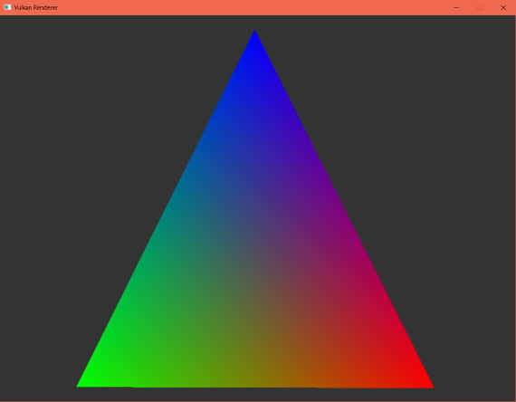
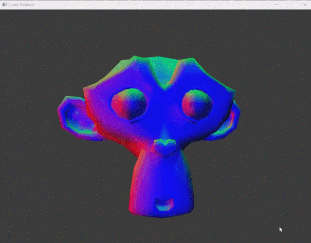

# VulkanEngine
Vulkan Engine is my first try to write engine using Vulkan. This project is based on the ideas outlined on the https://vkguide.dev/ and use the vulkan.hpp which provide C++ bindings for the Vulkan API. 

## What the engine can do now?

# - Render simple primitives

# - Render 3d objects

# - Generate ambient light

## Future Plans
- [ ] Recreate and refactor engine architecture
- [ ] Add the possibility to control the scene using gui
- [ ] Add texture support
- [ ] Add different types of lighting
- [ ] Add PBR and 
- [ ] ...
